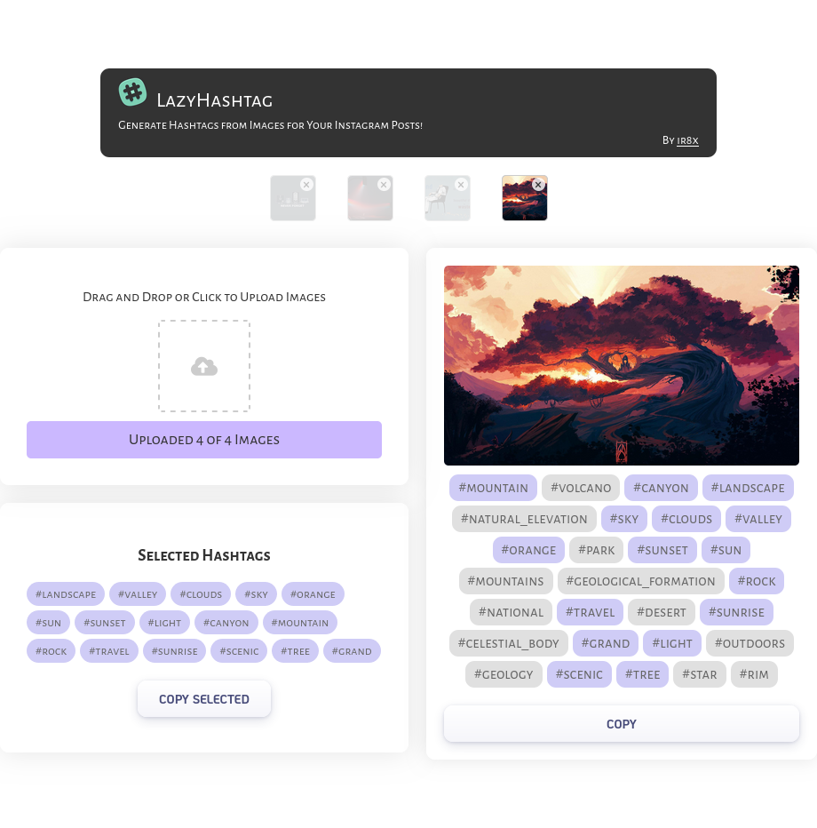

<h1 align="center"></h1>

<p align="center"><b>Generate Hashtags from Images for Your Instagram Posts</b></p>

<p align="center"><a href="https://lazyhashtags.vercel.app"><b> Try it out </b></a></p>

## Overview

I built this app for fun, to automatically generate hashtags for my Instagram posts. It came about because I wanted an easy way to do this, and it works well.

<p align="center"></p>


## Getting Started

To run the Lazy Hashtags application locally, follow these steps:

1. Clone the repository:

```sh
git clone https://github.com/CodeDotJS/LazyHashTags
```

2. Install the required packages:

```sh
cd LazyHashTags
pip install -r requirements.txt
```

3. You will need an Imagga API key to use the hashtag generation feature. You can get it by signing up for a free account on [Imagga](https://imagga.com/).

4. Create an `.env` in the root of the folder and replace `<YOUR API KEY>` with your own key.

```py
AUTH_KEY=<YOUR API KEY>
```

- Run the application

```sh
python main.py
```

5. Start uploading images and generating hashtags!


## Contributing

Contributions are welcome! If you find any bugs or have suggestions for improvements, please feel free to submit a pull request or open an issue.

## License

This project is licensed under the [MIT License](LICENSE).
